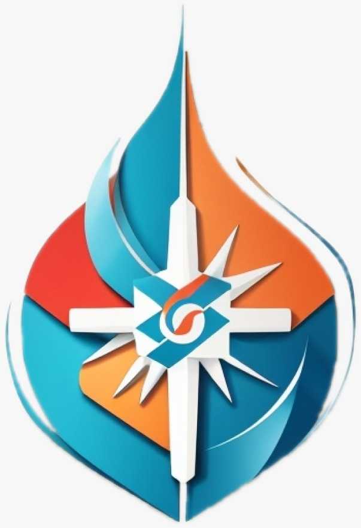

# Team-69
## Care Compass

# A Doctor-Patient Interface.

Are you tired of long wait times, confusing paperwork, and unnecessary delays when it comes to your healthcare? We understand how valuable your time is, and that's why we're here to revolutionize your healthcare journey.

Our cutting-edge healthcare platform is designed to make your experience as efficient and hassle-free as possible. With our seamless system.

# Key Features:

**1)Real-time Hospital Allocation for Emergency Cases.**

**2)Reduced Wait-Time for Appointments** 

**3)Efficient Patient Profile Management for Comprehensive Medical History.**

**4)Centralized Medical Updates and Collaboration Platform**

**5)Medication Management and Follow-Up Visits**
_______________________________________________________________________________________________________________________________________________________________________
SOVAN MOHANTY => Schema Model and Ml model

RAMBHA JHA => Documentation, Flowchart and Ml model 

AKASH PARIDA => UI/UX designing and Reactjs Frontend

BALAJI ARYAN => Flutter app development

ANIRBAN BOSE => Java backend

ABHISHEK SHARMA => Reactjs Frontend
